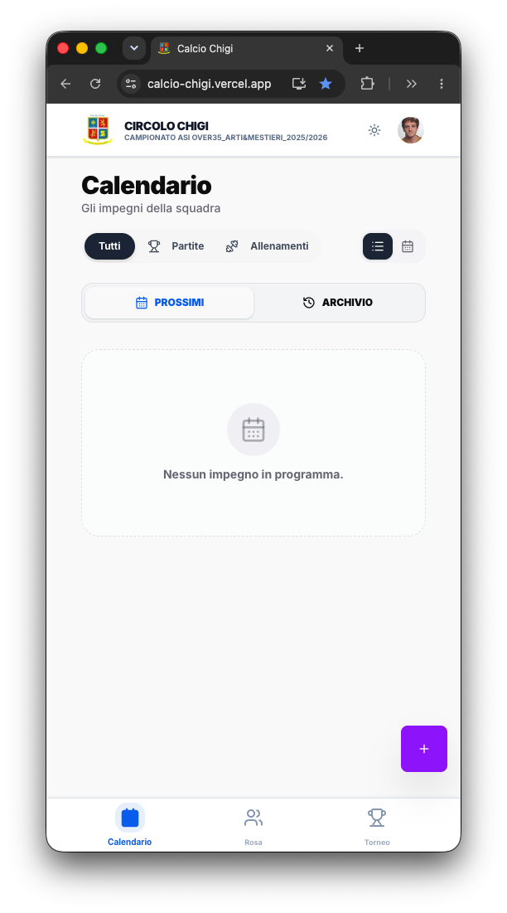

<div align="center">


# ⚽ Calcio Circolo Chigi

**Gestionale PWA della squadra di calcio del Circolo Chigi**
_Campionato ASI Over35 · Arti & Mestieri · 2025/2026_

[](https://calcio-chigi.vercel.app/)
[](https://nextjs.org/)
[](https://react.dev/)
[](https://www.typescriptlang.org/)
[](https://supabase.com/)
[](https://tailwindcss.com/)
[](#-progressive-web-app)
[](./LICENSE)

**[🌐 Apri la demo →](https://calcio-chigi.vercel.app/)**

</div>

---

## 📖 Cos'è

App **mobile-first** che digitalizza la vita di una squadra di calcio amatoriale: calendario impegni, disponibilità dei giocatori in tempo reale, rosa con formazione interattiva, classifica del torneo calcolata live e strumenti da bordo campo per i dirigenti (distinta ufficiale, convocazioni WhatsApp, aggiornamento risultati).

I dati del campionato vengono importati automaticamente da [Enjore](https://asicalciolazio.enjore.com/) (federazione ASI).

## 📑 Indice

- [Funzionalità](#-funzionalità)
- [Screenshot](#-screenshot)
- [Stack tecnico](#-stack-tecnico)
- [Dettagli tecnici](#-dettagli-tecnici)
- [Avvio rapido](#-avvio-rapido)
- [Comandi](#-comandi)
- [Variabili d'ambiente](#-variabili-dambiente)
- [Sync Enjore](#-sync-enjore)
- [Struttura del progetto](#-struttura-del-progetto)
- [Sicurezza](#-sicurezza)
- [Licenza](#-licenza)

## ✨ Funzionalità

### 👤 Giocatori

- **Calendario** partite e allenamenti con doppia vista **lista / mese**, filtri per tipo, countdown al prossimo match.
- **Disponibilità (RSVP)** in tempo reale: `Presente` / `Assente` / `Infortunato-Presente` (spettatore), con sincronizzazione istantanea su tutti i dispositivi.
- **Rosa** con card giocatore: ruolo, numero maglia, quota Under 35, stato infermeria, caratteristiche (tag).
- **Profilo**: anagrafica, avatar (upload con validazione), taglia divisa, tessera ASI, note mediche, preferenza vista calendario.
- **Torneo**: classifica dinamica con spareggi da regolamento, calendario per giornata, forma delle ultime partite, comunicati ufficiali (PDF).

### 🛡️ Dirigenti (Manager)

- **Gestione eventi**: crea / modifica / annulla partite e allenamenti (fase torneo, giornata, campo a 8/11).
- **Formazione interattiva**: campo con **drag & drop** ([dnd-kit](https://dndkit.com/)), moduli 4-4-2 / 4-3-3 / 3-5-2 / 4-2-3-1, capitano/vice, colore maglia, controllo quota U35 in campo e totale.
- **Export distinta ufficiale** in **Excel** ([ExcelJS](https://github.com/exceljs/exceljs)) precompilata dal template, ed export **PNG** della formazione ([html-to-image](https://github.com/bubkoo/html-to-image)).
- **Convocazioni WhatsApp**: messaggio generato automaticamente (ritrovo, divisa, elenco convocati diviso Under/Over/Portieri).
- **Override presenze** e **aggiornamento risultati** inline dalla pagina torneo.
- **Permessi**: assegnazione ruoli `manager` / `staff` (protetta a livello DB).

## 🖼️ Screenshot

> Placeholder — sostituisci con screenshot reali (consigliato: `.github/screenshots/`).

| Calendario | Formazione | Classifica |
| :---: | :---: | :---: |
|  |  |  |

<!-- Sostituisci con:  -->

## 🧩 Stack tecnico

| Area | Tecnologia |
| --- | --- |
| Framework | [Next.js 16](https://nextjs.org/) (App Router, Turbopack) · React 19 |
| Linguaggio | [TypeScript](https://www.typescriptlang.org/) 5 |
| Backend | [Supabase](https://supabase.com/) — PostgreSQL 17, Auth, Storage, Realtime |
| Auth | Magic Link + Google OAuth ([@supabase/ssr](https://supabase.com/docs/guides/auth/server-side)) |
| Styling | [Tailwind CSS](https://tailwindcss.com/) 4 · [shadcn/ui](https://ui.shadcn.com/) su [Radix UI](https://www.radix-ui.com/) |
| Icone / Toast | [Lucide](https://lucide.dev/) · [Sonner](https://sonner.emilkowal.ski/) · tema chiaro/scuro ([next-themes](https://github.com/pacocoursey/next-themes)) |
| Utility | [date-fns](https://date-fns.org/) · [dnd-kit](https://dndkit.com/) · [ExcelJS](https://github.com/exceljs/exceljs) · [html-to-image](https://github.com/bubkoo/html-to-image) |
| Deploy | [Vercel](https://vercel.com/) |
| Runtime | Node.js ≥ 20 |

## 🧠 Dettagli tecnici

- **Realtime** — canali Supabase Realtime su `events` e `attendance`: presenze, risultati e nuovi eventi si aggiornano in tempo reale su tutti i client, con dedup per evitare doppioni con gli update ottimistici.
- **Classifica ibrida** — punti, differenza reti e ordinamento calcolati client-side in [`lib/utils.ts`](./src/lib/utils.ts) per aggiornamento istantaneo. Spareggi da regolamento ASI: mini-classifica avulsa (scontri diretti → diff reti → gol fatti) prima dei criteri generali.
- **Client Supabase singleton** — un unico [`lib/supabaseBrowser.ts`](./src/lib/supabaseBrowser.ts) (cookie-based, `@supabase/ssr`) condiviso da tutte le pagine; sessione refreshata a ogni richiesta da [`src/proxy.ts`](./src/proxy.ts) (convenzione *Proxy* di Next 16, ex middleware).
- **Query centralizzate** — tutte le letture Supabase in [`lib/api.ts`](./src/lib/api.ts), tipizzate.
- **Immagini** — `next/image` con `remotePatterns` per i loghi (Enjore CDN); avatar su Supabase Storage.
- **PWA** — installabile su iOS/Android, service worker per caching statico, tema e icone dedicate.

## 🚀 Avvio rapido

```bash
# 1. Clona
git clone https://github.com/marcocipriani/calcio-chigi.git
cd calcio-chigi

# 2. Dipendenze
npm install

# 3. Variabili d'ambiente (vedi sotto)
cp .env.example .env.local   # poi compila le chiavi

# 4. Sviluppo
npm run dev
```

App su [http://localhost:3000](http://localhost:3000).

## 🛠️ Comandi

| Comando | Descrizione |
| --- | --- |
| `npm run dev` | Server di sviluppo (Turbopack) |
| `npm run build` | Build di produzione |
| `npm run start` | Serve la build |
| `npm run lint` | ESLint |
| `npm run sync:enjore` | Anteprima sync calendario Enjore (nessuna scrittura) |
| `npm run sync:enjore:sql` | Genera l'SQL di update del calendario |

## 🔑 Variabili d'ambiente

Crea `.env.local` nella root:

```env
NEXT_PUBLIC_SUPABASE_URL=https://<project>.supabase.co
NEXT_PUBLIC_SUPABASE_KEY=<anon-public-key>
SUPABASE_SERVICE_ROLE_KEY=<service-role-key>   # solo per gli script di sync
NEXT_PUBLIC_SITE_URL=https://calcio-chigi.vercel.app   # opzionale, per i redirect auth
```

> `SUPABASE_SERVICE_ROLE_KEY` è segreto: usato solo lato server dagli script di sync, mai esposto al client.

## 🔄 Sync Enjore

Gli script in [`scripts/`](./scripts) importano i dati del torneo da Enjore verso Supabase (richiedono `SUPABASE_SERVICE_ROLE_KEY`).

| Script | Descrizione |
| --- | --- |
| `sync-enjore-calendar.mjs` | Upsert risultati e fixture in `events` (incluse partite a tavolino senza data) |
| `sync-enjore-comunicati.mjs` | Upsert comunicati ufficiali (PDF) in `comunicati` |

```bash
# Anteprima (nessuna scrittura)
node scripts/sync-enjore-calendar.mjs
node scripts/sync-enjore-comunicati.mjs

# Applica a Supabase
node scripts/sync-enjore-calendar.mjs --apply
node scripts/sync-enjore-comunicati.mjs --apply
```

Workflow GitHub Actions in [`.github/workflows/sync-enjore.yml`](./.github/workflows/sync-enjore.yml).
> ⏸️ **Lo schedule automatico è attualmente sospeso** (resta il trigger manuale `workflow_dispatch`). Per riattivarlo, togliere il commento al `cron` nel workflow. Richiede i secret `SUPABASE_URL` e `SUPABASE_SERVICE_ROLE_KEY`.

## 📂 Struttura del progetto

```text
src/
├── app/                    # Next.js App Router
│   ├── auth/callback/       # Callback OAuth / Magic Link
│   ├── classifica/          # Classifica (realtime) — usata anche embedded in /torneo
│   ├── evento/[id]/         # Dettaglio evento + presenze realtime
│   ├── login/               # Magic Link + Google
│   ├── profilo/             # Profilo, avatar, preferenze
│   ├── squadra/             # Rosa + formazione drag&drop + export
│   ├── torneo/              # Classifica + calendario + comunicati
│   ├── layout.tsx
│   └── page.tsx             # Home: calendario (lista/mese) + anteprima presenze
├── components/
│   ├── ui/                  # shadcn/ui (Radix + Tailwind)
│   ├── EventCard.tsx · EventDialog.tsx
│   ├── SiteHeader.tsx · BottomNav.tsx · AppCredits.tsx
│   └── theme-provider.tsx
├── lib/
│   ├── api.ts               # Query Supabase centralizzate
│   ├── supabaseBrowser.ts   # Client browser singleton (SSR cookie)
│   ├── utils.ts             # cn, calcolo classifica, età/U35
│   ├── types.ts · constants.ts · whatsappTemplate.ts
│   └── ServiceWorkerRegister.tsx
└── proxy.ts                 # Refresh sessione auth (Next 16)

supabase/
├── schema.sql               # Snapshot schema completo
└── migrations/              # RLS, trigger anti role-escalation, hardening funzioni
scripts/                     # Sync Enjore (calendario + comunicati)
public/                      # Icone PWA, manifest, service worker, template distinta
```

## 🔒 Sicurezza

- **Row Level Security** attiva su tutte le tabelle: lettura pubblica per la squadra, scrittura ristretta ai manager.
- **Trigger anti role-escalation** — `prevent_role_escalation()` impedisce a un utente non-manager di modificare `is_manager` / `is_staff` (RLS non può filtrare per colonna).
- **Hardening funzioni** — `search_path` fissato e `EXECUTE` revocato da `public` sulle funzioni `SECURITY DEFINER` (non invocabili via RPC).
- **Storage** — bucket `avatars` pubblico in lettura via URL diretto; enumerazione anonima disabilitata.

Le policy e le migration vivono in [`supabase/migrations/`](./supabase/migrations).

## 📄 Licenza

Distribuito con licenza **MIT** — vedi [LICENSE](./LICENSE).

---

<div align="center">

Sviluppato da **Marco Cipriani** · con il supporto di **Claude** (Anthropic)

</div>
